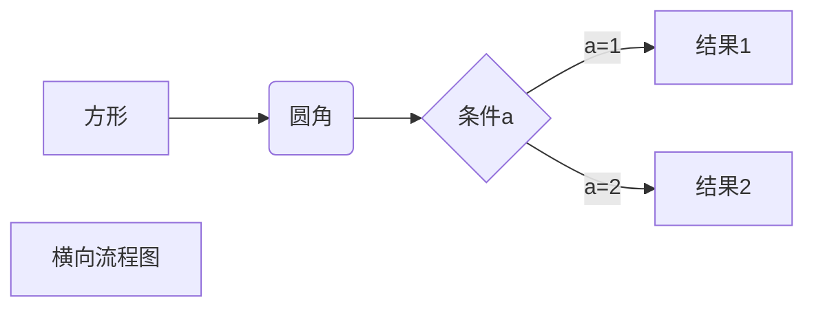
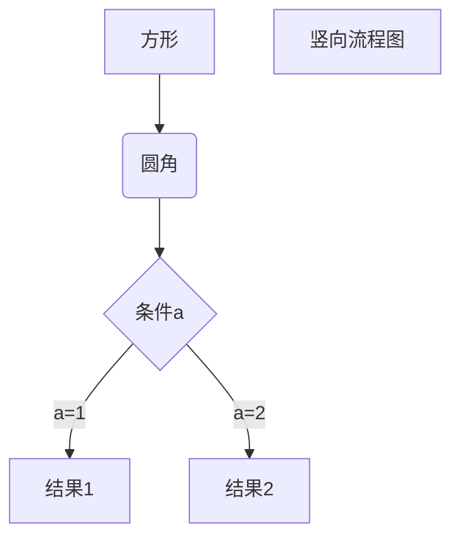
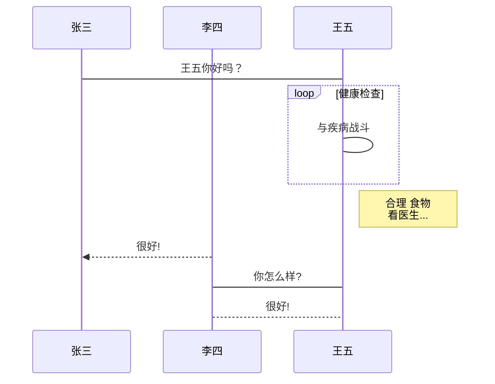
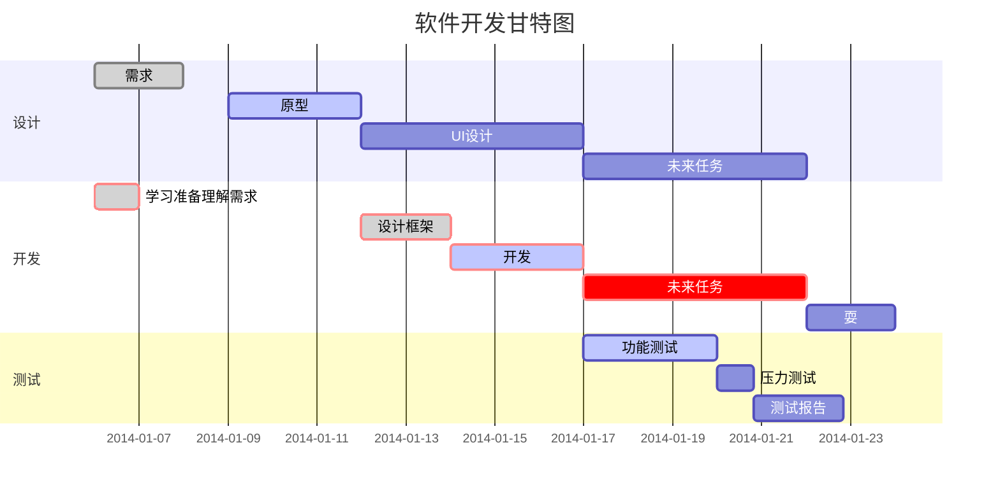

# Markdown 基础

## 1 准备

### 1.1 前言

&emsp;&emsp;最近在看书，突然了解到了一个比较有意思并且有用的语言：**Markdown**。这个语言是用在 **.md** 文件的编写上的。可以比较容易的使用纯文本格式编写出十分美观的文档。

&emsp;&emsp;之前，我准备在 **CSDN** 上写博客的时候，看到写一个博客竟然和写代码一样，还要学习一门新语言，我立马就被劝退了。不过在前两天了解了 **Markdown** 语言之后，才发现这还挺好用。不仅简单，而且对于图片、图表、数学式都有支持。回过头来，突然发现我们的**CSDN**也支持使用 **Markdown** 语言来写博客文章，当初我竟然被这么个语言给劝退了...


&emsp;&emsp;网上已经有很多十分优秀的 **Markdown** 语言教程了，比如[菜鸟教程](https://www.runoob.com)的 **Markdown** 教程。本篇只是记录自己的学习过程，如有错误，还望大家海涵。若能指出错误，在下将十分感激！

---

### 1.2 编辑器选择

&emsp;&emsp;作为新手，如果你使用纯文本编辑器，比如记事本，带来的问题可不仅仅是不方便这么简单。更致命的一点是在纯文本编辑器中使用 **Markdown** 语言没有即时预览功能，你无法直观的感受到你写出的文档最终会以什么样子呈现出来。所以我比较推荐大家使用具有即使预览功能的编辑器，比如我目前使用的[Typora](https://typora.io/)，我觉得就是一款很棒的**Markdown**语言编辑器。由于我刚开始学习，用过的编辑器也不多，不能给出更多的推荐了。

&emsp;&emsp;如果你平常使用**Sublime Text**或者 **VsCode** ，他们虽然没有自带即时预览的功能，但是他们有着十分强大、丰富的社区，你可以通过一系列的折腾来武装你的编辑器，来使他们能够很好的支持你对于**Markdown**语言的使用，这些操作的教程以级实例在网络上可以轻松的找到。其他类似的编辑器也可以进行类似的操作。

## 2 语法

### 2.1标题

使用 **#** 号可表示标题，一级标题对应一个 **#** 号，二级标题对应两个 **#** 号，以此类推。

```markdown
# 一级标题
## 二级标题
### 三级标题
#### 四级标题
```

*效果如下：*


在编辑器Typora里可以使用**Ctrl+[0-6]**来快速设置格式，**Ctrl+0**是设置成段落，1到6是设置成各级标题。

### 2.2 段落样式

#### 2.2.1 字体

```markdown
Markdown可以使用以下几种字体：
*斜体文本*
_斜体文本_
**粗体文本**
__粗体文本__
***粗斜体文本***
___粗斜体文本___
```

效果如下：

*斜体文本*

_斜体文本_

**粗体文本**

__粗体文本__

***粗斜体文本***

___粗斜体文本___

#### 2.2.2 修饰

(1) 分隔线

```markdown
一行内三个以上的星号(*)、减号(-)、底线(_)，行内不能有其他东西。
如：***
```

效果如下：

***

(2) 删除线

```markdown
文字两端加上两个波浪线~
~~xianyue~~
```

效果如下：

~~xianyue~~

(3) 下划线

```markdown
使用HTML的<u>标签实现
如：<u>xianyue</u>
```

效果如下：

<u>xianyue</u>

(4) 脚注

```markdown
使用[^文本]的格式实现脚注
如：脚注[^xinayue]: xianyue
```

效果如下：

脚注[^xinayue]

### 2.3 元素

#### 2.3.1 列表

(1) 无序列表

无序列表使用星号(*)、加号(+)或是减号(-)作为列表标记，这些标记后面要添加一个空格，然后再填写内容。

```markdown
如：
* 第一项
* 第二项
* 第三项
```

效果如下：

* 第一项
* 第二项
* 第三项

(2) 有序列表

有序列表使用数字并加上 **.** 号来表示。

```markdown
如：
1. 第一项
2. 第二项
3. 第三项
```

效果如下：

1. 第一项
2. 第二项
3. 第三项

#### 2.3.2 区块

区块引用是在段落开头使用 **>** 符号 ，然后后面紧跟一个**空格**。

```markdown
> 最外层
> > 第一层嵌套
> > > 第二层嵌套
```

效果如下：

> 最外层
>
> > 第一层嵌套
> >
> > > 第二层嵌套

#### 2.3.3 代码

(1) 段内短代码

可以用反引号把它包起来（**`**）。

```
如：
`print("HelloWorld!")`Python代码
```

效果如下：

`print("HelloWorld!")`Python代码

(2) 代码区块

用 **```** 包裹一段代码，并指定一种语言（也可以不指定）。本文多处都在此种方式创造的代码区块内进行说明（比如下面这个区块）。

```
如：
​```python
print("HelloWorld!")
```

效果如下：

```python
print("HelloWorld!")
```

#### 2.3.4 链接

(1) 通过网址来设置一个链接

```markdown
[链接名称](链接地址)
如：
[百度](http://www.baidu.com)
```

效果如下：

[百度](http://www.baidu.com)

(2) 直接使用链接地址

```markdown
<http://www.baidu.com>
```

效果如下：

<http://www.baidu.com>


PS：可以使用如下方式达到`<http://www.baidu.com>`的效果。

```markdown
[http://www.baidu.com](http://www.baidu.com)
```

[http://www.baidu.com](http://www.baidu.com)


(3) 通过变量来设置一个链接

```markdown
[百度][1]
[1]:http://www.baidu.com
```

效果如下：

[百度][1]

[1]:http://www.baidu.com


#### 2.3.5 图片

(1) Markdown方法

```

这种方式无法指定图片的高度与宽度
如：

```

效果如下：


(2) HTML方法

```

```

效果如下：


#### 2.3.6 表格

```
使用 | 来分隔不同的单元格，使用 - 来分隔表头和其他行。
如：
|  ID   | Password  |
|  ----  | ----  |
| a  | 123 |
| b  | 456 |
```

效果如下（默认左对齐）：

| ID   | Password |
| ---- | -------- |
| a    | 123      |
| b    | 456      |

可以设置表格的对齐方式：

1. “-:”右对齐
2. “:-”左对齐
3. “:-:”居中

```
如：
|  ID   | Password  |
|  ----:  | ----:  |
| a  | 123 |
| b  | 456 |
```

效果如下：

|   ID | Password |
| ---: | -------: |
|    a |      123 |
|    b |      456 |

## 3 高级技巧

### 3.1 HTML支持

前面我们已经在**Markdown**里使用了**HTML**标签，其实许多**HTML**标签在**Markdown**都能支持。其实，**Markdown**的表现格式是可以通过**CSS**来进行更改的，**Typora**里的众多主体就是通过使用不同的**CSS**文件来达成的。还有，你如果在**Typora**里打开了调试模式，右键点击**检查元素**，然后你会发现这和网页源代码有着惊人的相似度。这也就不难想象**Markdown**与**HTML**、**CSS**之间的密切联系了。

### 3.2 转义

Markdown 使用了很多特殊符号来表示特定的意义，如果需要显示特定的符号则需要使用转义字符，Markdown 使用反斜杠转义特殊字符。

```
\   反斜线
`   反引号
*   星号
_   下划线
{}  花括号
[]  方括号
()  小括号
#   井字号
+   加号
-   减号
.   英文句点
!   感叹号
```


### 3.3 Tex支持

当你需要在编辑器中插入数学公式时，可以使用美元符 $$ 包裹 TeX 或 LaTeX 格式的数学公式来实现。提交后，问答和文章页会根据需要加载 Mathjax 对数学公式进行渲染。

比如：

```
$$
\mathbf{V}_1 \times \mathbf{V}_2 =  \begin{vmatrix} 
\mathbf{i} & \mathbf{j} & \mathbf{k} \\
\frac{\partial X}{\partial u} &  \frac{\partial Y}{\partial u} & 0 \\
\frac{\partial X}{\partial v} &  \frac{\partial Y}{\partial v} & 0 \\
\end{vmatrix}
$$
```


$$
\mathbf{V}_1 \times \mathbf{V}_2 =  \begin{vmatrix} 
\mathbf{i} & \mathbf{j} & \mathbf{k} \\
\frac{\partial X}{\partial u} &  \frac{\partial Y}{\partial u} & 0 \\
\frac{\partial X}{\partial v} &  \frac{\partial Y}{\partial v} & 0 \\
\end{vmatrix}
$$

## 附录 ：

### 1、横向流程图：



### 2、竖向流程图



### 3、标准流程图

```flow
st=>start: 开始框
op=>operation: 处理框
cond=>condition: 判断框(是或否?)
sub1=>subroutine: 子流程
io=>inputoutput: 输入输出框
e=>end: 结束框
st->op->cond
cond(yes)->io->e
cond(no)->sub1(right)->op
```


```flow
st=>start: 开始框
op=>operation: 处理框
cond=>condition: 判断框(是或否?)
sub1=>subroutine: 子流程
io=>inputoutput: 输入输出框
e=>end: 结束框
st(right)->op(right)->cond
cond(yes)->io(bottom)->e
cond(no)->sub1(right)->op
```


### 4、 UML时序图

```sequence
对象A->对象B: 对象B你好吗?（请求）
Note right of 对象B: 对象B的描述
Note left of 对象A: 对象A的描述(提示)
对象B-->对象A: 我很好(响应)
对象A->对象B: 你真的好吗？
```

### 5、标准UML时序图



### 6、甘特图




